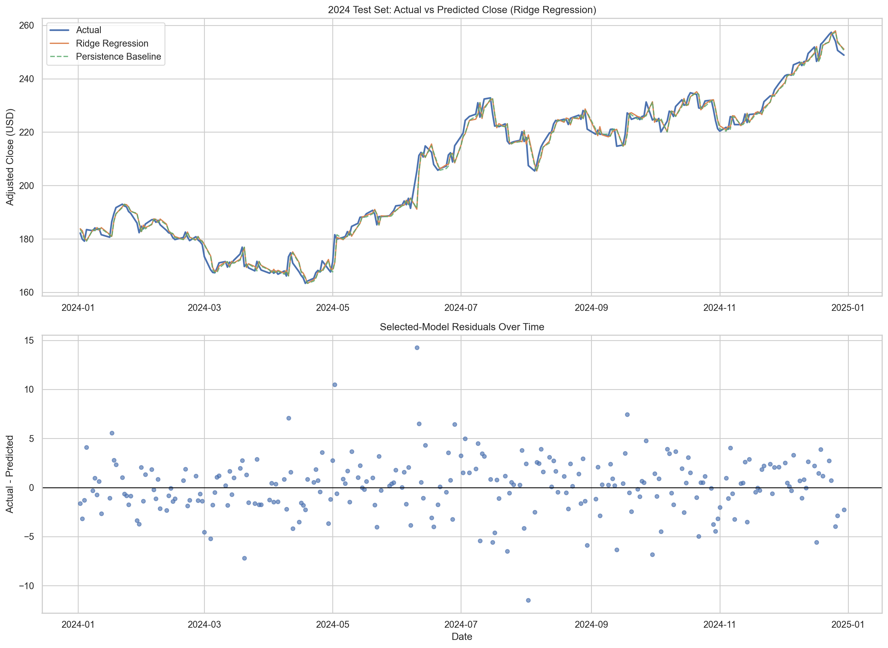
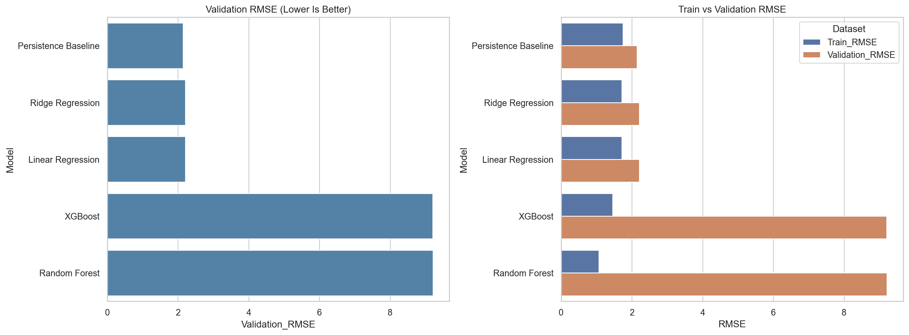
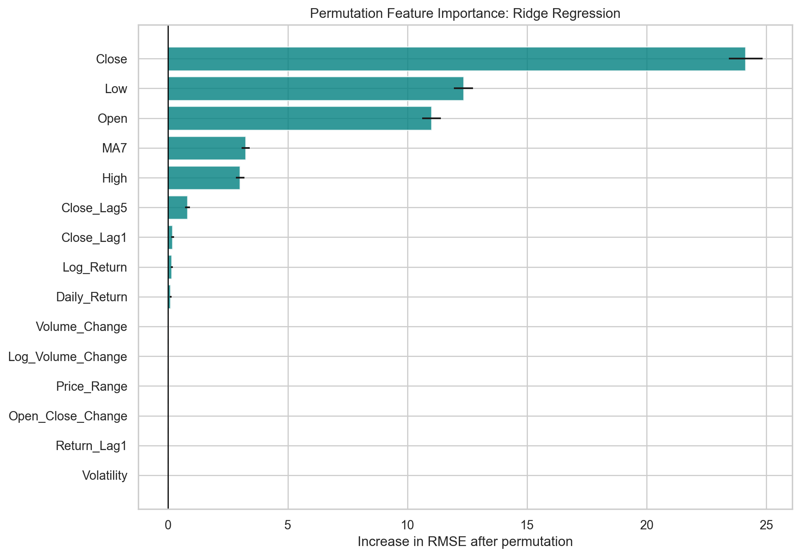

# AAPL Next-Day Adj Close Forecast

CSM3601 Group 13 · Ridge regression on engineered daily features.

**Portfolio:** https://hawk327ml.github.io/  
**Live demo (Streamlit Cloud):** https://aapl-stock-prediction-3scusseltfmnzjcthk2lp8.streamlit.app/  
**Poster:** [`docs/poster/A3_AAPL_Final_Editable_Poster2.pdf`](docs/poster/A3_AAPL_Final_Editable_Poster2.pdf)

> Streamlit **app source is not in this repo** (unavailable). Portfolio keeps Live + poster + reproducible notebooks/artifacts only.

## Result (canonical)

Locked from the modeling notebook / `best_model_metadata.json` after **2023 validation** selection, then **2024 test** evaluation:

| Metric | Value |
|--------|-------|
| Model | Ridge (`alpha=0.01`) |
| Target | `Target_Close_t1` (next trading day Adj Close) |
| Test MAE | **2.12** |
| Test RMSE | **2.88** |
| Test R² | **0.987** |
| Directional accuracy | **49.0%** |

Poster / Streamlit UI numbers may differ — **notebook metrics are the public source of truth**.

### Honest read

- Persistence baseline (today’s close → tomorrow) is slightly better on 2024 test RMSE; next-day **price level** is hard to beat.
- High R² ≠ trading edge: directional accuracy ≈ coin flip.
- Academic demo only — **not financial advice**.

## Key figures







## Quick demo (no Streamlit rebuild)

Replay locked 2024 test predictions from saved artifacts:

```bash
pip install -r requirements.txt
python scripts/predict_demo.py
```

Optional: load the joblib pipeline and re-score the last N test rows (needs compatible `scikit-learn`):

```bash
python scripts/predict_demo.py --rescore 5
```

## Repo map

| Path | Content |
|------|---------|
| `Submission_By_Phase/02_*` | Cleaning + EDA notebooks + CSVs |
| `Submission_By_Phase/03_*` | Model notebook, figures, `models/*.joblib`, metrics CSVs |
| `Submission_By_Phase/04_*` | Evaluation write-ups by member |
| `Submission_By_Phase/05_*` | Presentation / demo speaking notes |
| `docs/poster/` | Final A3 poster PDF |

## Reproduce notebooks

```bash
pip install -r requirements.txt
```

1. `Submission_By_Phase/02_Data_Preparation_EDA_20pct/AAPL_Data_Preparation_EDA_Final.ipynb`
2. `Submission_By_Phase/03_Model_Development_30pct/AAPL_Model_Development.ipynb`
3. Discussion: `Submission_By_Phase/03_Model_Development_30pct/results/model_development_discussion.md`

Train / validation / test windows (chronological): **2015–2022 / 2023 / 2024**.

## Stack

Python · pandas · scikit-learn · XGBoost (compared, not locked) · matplotlib · joblib · Jupyter
